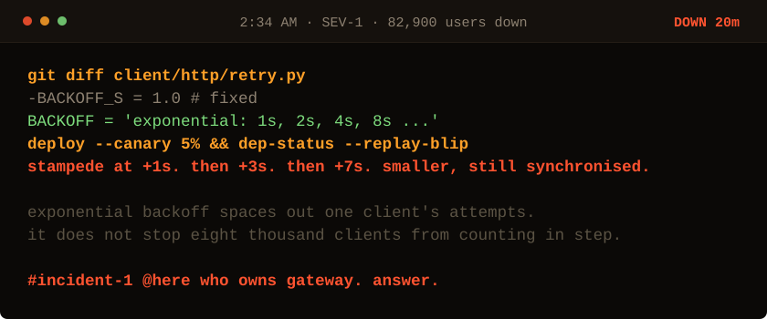

<!-- Generated by make_oncall.py. Every state in this game is a file. -->

<picture>
  <source media="(prefers-color-scheme: dark)" srcset="../assets/oncall/backoff-dark.svg">
  <source media="(prefers-color-scheme: light)" srcset="../assets/oncall/backoff-light.svg">
  
</picture>

**The textbook answer, and it only made the stampedes further apart.**

- [Add random jitter to every retry.](./end_win.md)
- [Good enough. Ship it and go to bed.](./end_backoff.md)

20 minutes down · 82,900 users out · no JavaScript is running. Every move is a different file in <a href="../oncall/">this folder</a>.
