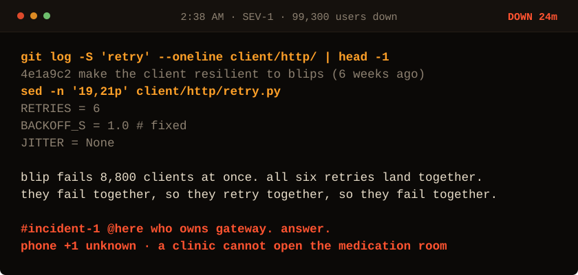

<!-- Generated by make_oncall.py. Every state in this game is a file. -->

<picture>
  <source media="(prefers-color-scheme: dark)" srcset="../assets/oncall/cause_mid-dark.svg">
  <source media="(prefers-color-scheme: light)" srcset="../assets/oncall/cause_mid-light.svg">
  
</picture>

**Six weeks ago someone made the client resilient. Four fixes. One works.**

- [Switch to exponential backoff.](./backoff_mid.md)
- [Add random jitter to every retry.](./end_win_mid.md)
- [Raise capacity permanently so the stampede fits.](./end_bad.md)
- [Rip the retries out. They caused this.](./end_fragile.md)

24 minutes down · 99,300 users out · no JavaScript is running. Every move is a different file in <a href="../oncall/">this folder</a>.
