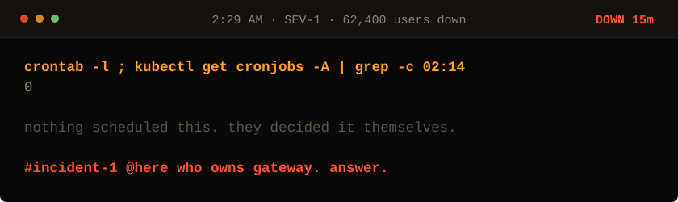

<!-- Generated by make_oncall.py. Every state in this game is a file. -->

<picture>
  <source media="(prefers-color-scheme: dark)" srcset="../assets/oncall/cron-dark.svg">
  <source media="(prefers-color-scheme: light)" srcset="../assets/oncall/cron-light.svg">
  
</picture>

**Nothing scheduled it. They synchronised on their own.**

- [Ask who told them all to wake on the same millisecond.](./cause.md)

15 minutes down · 62,400 users out · no JavaScript is running. Every move is a different file in <a href="../oncall/">this folder</a>.
