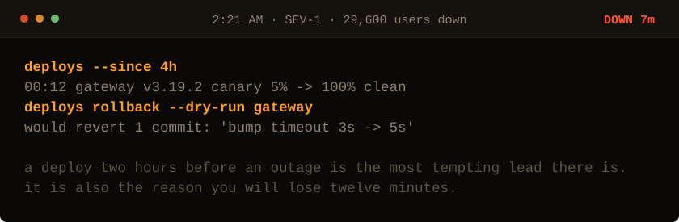

<!-- Generated by make_oncall.py. Every state in this game is a file. -->

<picture>
  <source media="(prefers-color-scheme: dark)" srcset="../assets/oncall/deploy-dark.svg">
  <source media="(prefers-color-scheme: light)" srcset="../assets/oncall/deploy-light.svg">
  
</picture>

**A timeout bump. Suspicious, and unrelated. Roll it back anyway?**

- [Roll it back. It is the only thing that changed.](./rollback.md)
- [Leave it. Read the gateway logs.](./logs_mid.md)

7 minutes down · 29,600 users out · no JavaScript is running. Every move is a different file in <a href="../oncall/">this folder</a>.
