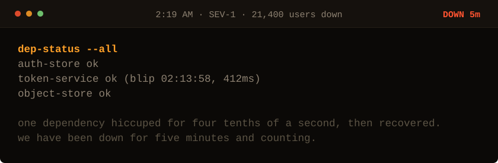

<!-- Generated by make_oncall.py. Every state in this game is a file. -->

<picture>
  <source media="(prefers-color-scheme: dark)" srcset="../assets/oncall/deps-dark.svg">
  <source media="(prefers-color-scheme: light)" srcset="../assets/oncall/deps-light.svg">
  
</picture>

**412 milliseconds, recovered. And we are still down. Those facts do not fit yet.**

- [Read the gateway logs.](./logs.md)

5 minutes down · 21,400 users out · no JavaScript is running. Every move is a different file in <a href="../oncall/">this folder</a>.
