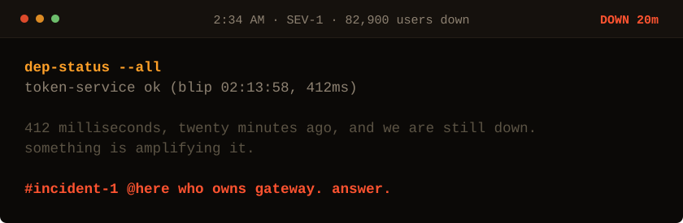

<!-- Generated by make_oncall.py. Every state in this game is a file. -->

<picture>
  <source media="(prefers-color-scheme: dark)" srcset="../assets/oncall/deps_mid-dark.svg">
  <source media="(prefers-color-scheme: light)" srcset="../assets/oncall/deps_mid-light.svg">
  
</picture>

**Something turned four tenths of a second into twenty minutes.**

- [Read the gateway logs.](./logs_mid.md)

20 minutes down · 82,900 users out · no JavaScript is running. Every move is a different file in <a href="../oncall/">this folder</a>.
