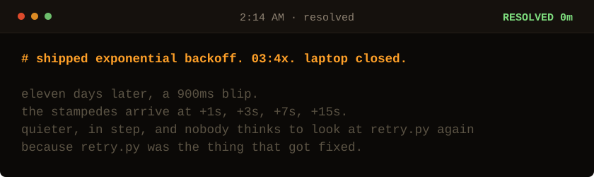

<!-- Generated by make_oncall.py. Every state in this game is a file. -->

<picture>
  <source media="(prefers-color-scheme: dark)" srcset="../assets/oncall/end_backoff-dark.svg">
  <source media="(prefers-color-scheme: light)" srcset="../assets/oncall/end_backoff-light.svg">
  
</picture>

### You shipped the textbook answer.

Exponential backoff is correct and it is not the fix. It spaces out one client's attempts. It does nothing about eight thousand clients counting in step with each other, so the stampedes just move further apart and get quieter.

This is the ending most engineers get, and the dangerous part is that it looks like a win for eleven days.

**Randomness is a safety feature. Anything that fails together will retry together.**

**Me: 7 minutes**, the night I found it, on the first pass, without a rate limit and without restarting anything.

[Take the page again](./start.md) · [I write these down](https://sarthaknimbalkar.in/) · [Back to the profile](../)
