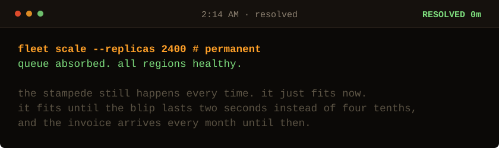

<!-- Generated by make_oncall.py. Every state in this game is a file. -->

<picture>
  <source media="(prefers-color-scheme: dark)" srcset="../assets/oncall/end_bad-dark.svg">
  <source media="(prefers-color-scheme: light)" srcset="../assets/oncall/end_bad-light.svg">
  
</picture>

### You paid for it instead.

Capacity hides a stampede the way a bigger bucket hides a leak.

The cause is still sitting in the client on a fixed one second beat, waiting for a blip long enough to outgrow the bucket you bought.

**Randomness is a safety feature. Anything that fails together will retry together.**

**Me: 7 minutes**, the night I found it, on the first pass, without a rate limit and without restarting anything.

[Take the page again](./start.md) · [I write these down](https://sarthaknimbalkar.in/) · [Back to the profile](../)
