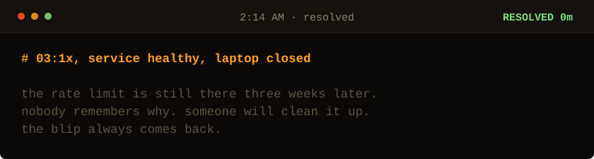

<!-- Generated by make_oncall.py. Every state in this game is a file. -->

<picture>
  <source media="(prefers-color-scheme: dark)" srcset="../assets/oncall/end_bleeding-dark.svg">
  <source media="(prefers-color-scheme: light)" srcset="../assets/oncall/end_bleeding-light.svg">
  
</picture>

### You stopped the bleeding.

Which is the correct first move, and it is not the job.

The rate limit will outlive everyone's memory of why it exists. That is precisely how this comes back.

**Randomness is a safety feature. Anything that fails together will retry together.**

**Me: 7 minutes**, the night I found it, on the first pass, without a rate limit and without restarting anything.

[Take the page again](./start.md) · [I write these down](https://sarthaknimbalkar.in/) · [Back to the profile](../)
