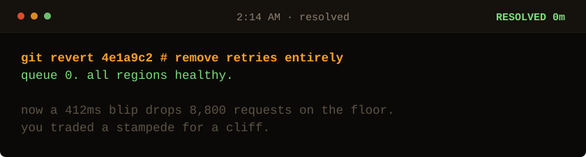

<!-- Generated by make_oncall.py. Every state in this game is a file. -->

<picture>
  <source media="(prefers-color-scheme: dark)" srcset="../assets/oncall/end_fragile-dark.svg">
  <source media="(prefers-color-scheme: light)" srcset="../assets/oncall/end_fragile-light.svg">
  
</picture>

### You traded one failure for another.

With no retries at all, that 412ms blip drops eight thousand requests instead of amplifying them.

Retrying was the right instinct. Retrying in unison was the bug. You threw out the instinct and kept the lesson backwards.

**Randomness is a safety feature. Anything that fails together will retry together.**

**Me: 7 minutes**, the night I found it, on the first pass, without a rate limit and without restarting anything.

[Take the page again](./start.md) · [I write these down](https://sarthaknimbalkar.in/) · [Back to the profile](../)
