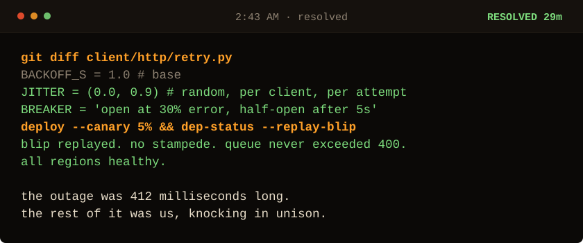

<!-- Generated by make_oncall.py. Every state in this game is a file. -->

<picture>
  <source media="(prefers-color-scheme: dark)" srcset="../assets/oncall/end_win_mid-dark.svg">
  <source media="(prefers-color-scheme: light)" srcset="../assets/oncall/end_win_mid-light.svg">
  
</picture>

### You found it.

A dependency was gone for 412 milliseconds. Everything after that was us: eight thousand clients that failed on the same instant, and therefore retried on the same instant, forever. The fix was one line of randomness and one circuit breaker.

Nothing in the logs said stampede. No alert fires on *these timestamps agree too well*. You got here by asking who told them all to wake up together, and that is not a command you can run.

**Randomness is a safety feature. Anything that fails together will retry together.**

**You: 29 minutes.**  ·  **Me: 7 minutes.**  That is the record and it is not close. The fastest route this thing allows is 19 minutes, so you were never going to catch me.

[Take the page again](./start.md) · [I write these down](https://sarthaknimbalkar.in/) · [Back to the profile](../)
