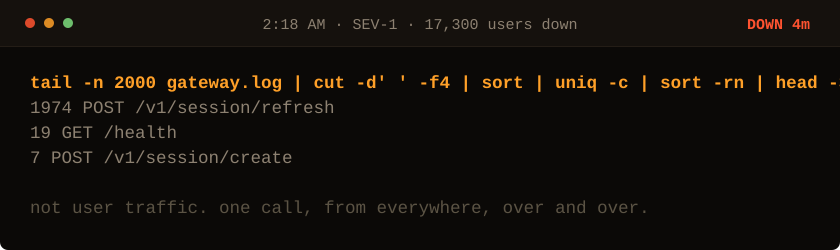

<!-- Generated by make_oncall.py. Every state in this game is a file. -->

<picture>
  <source media="(prefers-color-scheme: dark)" srcset="../assets/oncall/logs-dark.svg">
  <source media="(prefers-color-scheme: light)" srcset="../assets/oncall/logs-light.svg">
  
</picture>

**One endpoint, repeated. Now decide what that means.**

- [We are being hammered. Scale up.](./scale.md)
- [Throttle that endpoint and stop the bleeding.](./throttle.md)
- [Look at the timestamps.](./stamps.md)

4 minutes down · 17,300 users out · no JavaScript is running. Every move is a different file in <a href="../oncall/">this folder</a>.
