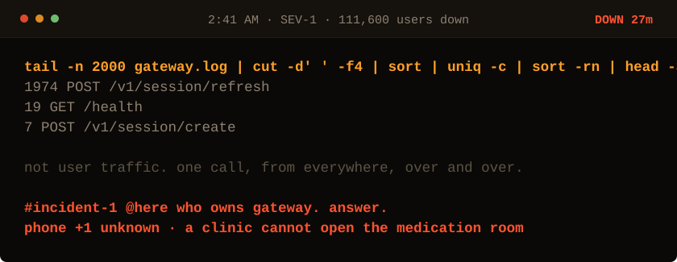

<!-- Generated by make_oncall.py. Every state in this game is a file. -->

<picture>
  <source media="(prefers-color-scheme: dark)" srcset="../assets/oncall/logs_late-dark.svg">
  <source media="(prefers-color-scheme: light)" srcset="../assets/oncall/logs_late-light.svg">
  
</picture>

**One endpoint, repeated. Now decide what that means.**

- [We are being hammered. Scale up.](./scale_late.md)
- [Throttle that endpoint and stop the bleeding.](./throttle_late.md)
- [Look at the timestamps.](./stamps_late.md)

27 minutes down · 111,600 users out · no JavaScript is running. Every move is a different file in <a href="../oncall/">this folder</a>.
