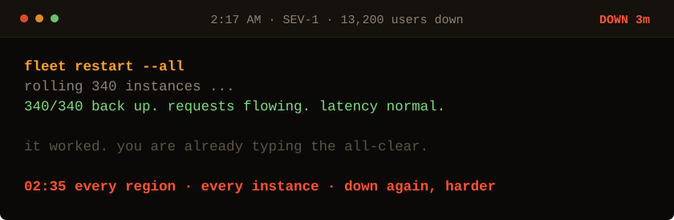

<!-- Generated by make_oncall.py. Every state in this game is a file. -->

<picture>
  <source media="(prefers-color-scheme: dark)" srcset="../assets/oncall/restart-dark.svg">
  <source media="(prefers-color-scheme: light)" srcset="../assets/oncall/restart-light.svg">
  
</picture>

**Eleven good minutes, then it died worse than before.**

- [Read the gateway logs.](./logs_late.md)
- ~~Restart the fleet again.~~ you just watched what that buys you

3 minutes down · 13,200 users out · no JavaScript is running. Every move is a different file in <a href="../oncall/">this folder</a>.
