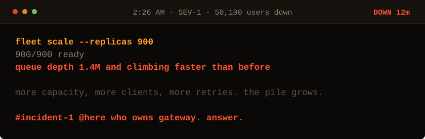

<!-- Generated by make_oncall.py. Every state in this game is a file. -->

<picture>
  <source media="(prefers-color-scheme: dark)" srcset="../assets/oncall/scale-dark.svg">
  <source media="(prefers-color-scheme: light)" srcset="../assets/oncall/scale-light.svg">
  
</picture>

**Capacity made it worse. That should tell you something about the shape of this.**

- [Look at the timestamps.](./stamps.md)
- ~~Scale up further.~~ the queue grew last time

12 minutes down · 50,100 users out · no JavaScript is running. Every move is a different file in <a href="../oncall/">this folder</a>.
