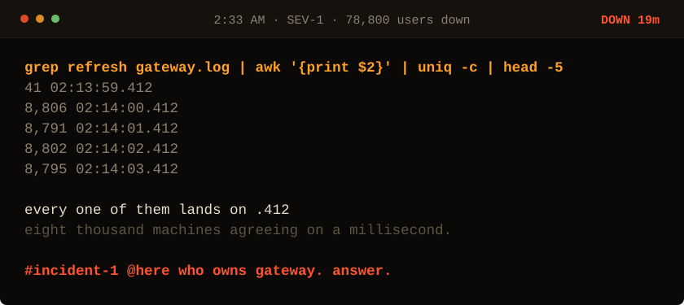

<!-- Generated by make_oncall.py. Every state in this game is a file. -->

<picture>
  <source media="(prefers-color-scheme: dark)" srcset="../assets/oncall/stamps_mid-dark.svg">
  <source media="(prefers-color-scheme: light)" srcset="../assets/oncall/stamps_mid-light.svg">
  
</picture>

**They are not arriving. They are arriving together.**

- [Something must be scheduling them. Check cron.](./cron_mid.md)
- [The load balancer must be batching them.](./lb_mid.md)
- [Ask who told them all to wake on the same millisecond.](./cause_mid.md)

19 minutes down · 78,800 users out · no JavaScript is running. Every move is a different file in <a href="../oncall/">this folder</a>.
